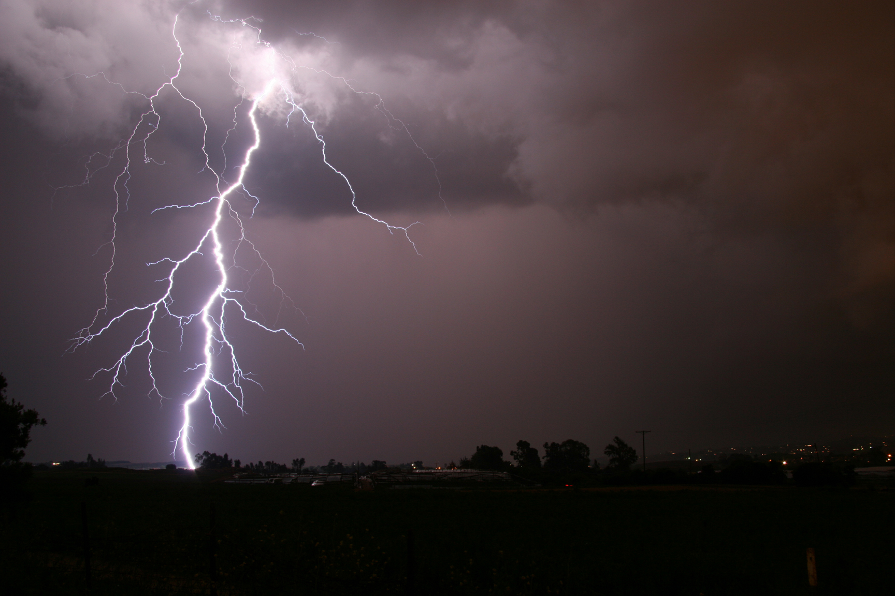

# **Storms Lightning Detector** 


Descarga últimos 12 escaneos del sensor GLM del satélite GOES-16 con la información de actividad eléctrica. Con ellos, genera una animación de detecciones. 

---

## **Tabla de Contenidos**
1. [Resumen](#resumen)  
2. [Características](#características)  
3. [Instalación](#instalación)
4. [Elementos](#ielementos)
7. [Créditos](#créditos)
8. [Autor](#alumno) 
9. [Contacto](#contacto)   

---

## **Resumen**
El trabajo se desdobla en dos partes:

Descarga de escaneos disponibles. El script conecta con el repositorio y descarga los últimos 12 archivos disponibles. Estos contienen la información de ubicación (en latitud y longitud), energía, área etc. de eventos, grupos y flashes.

En segunda instancia, se toman los escaneos detectados y se generan las imagenes georeferenciadas de cada uno. Finalmente, estas se compilan en un video para generar la animación temporal de las detecciones de grupo.

---

## **Características**
- 🖊️ Confiabilidad.  
- 💽 Baja disponibilidad de espacio.  
- 💻​ Mínimo costo computacional.  
- 📝 Operativo.
---

## **Instalación**
Pasos para instalar y configurar el proyecto:  

### Requisitos Previos 
-  
- 🛜 Acceso a internet  

### Pasos
1. Clona el repositorio:  
   ```bash  
   git clone https://github.com/fabriciolopretto/Storms-Lightning-Detector.git  
   cd Storms-Lightning-Detector

---

## **Elementos**
1. Notebooks par descarga y visualización de imagen/video.
2. Lista de variables disponibles en los escaneos.
3. Estructura para archivos de escaneos, imagenes y videos generados.

---
## **Créditos**
Agradecimientos a las siguientes bibliotecas y recursos:

- Basemap
- Pandas
- netCDF4
- s3fs

---

## **Autor**
Lic. Fabricio Lopretto </h1>.

---

## **Contacto**
Para dudas o sugerencias, contacto en:
<a href="mailto:fabriciolopretto@gmail.com.ar">
  
</a>
<a href="https://www.linkedin.com/in/fabricio-lopretto-scientific-analyst/"></a>